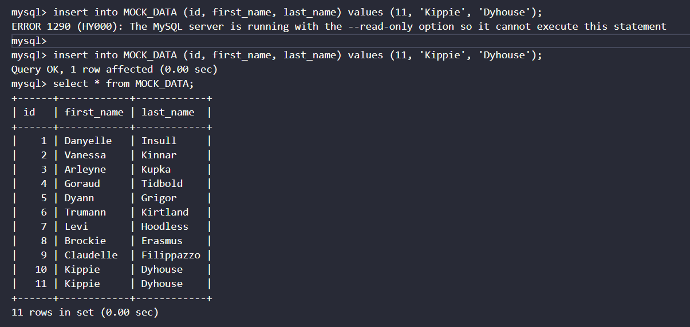

Because my account is running out of money, I cannot capture more image or write another log file.

But, in my previous submission, the "log_rr_after_promoting.txt" file contains:

Does it show that I cannot write to readreplica database.

Thanks.